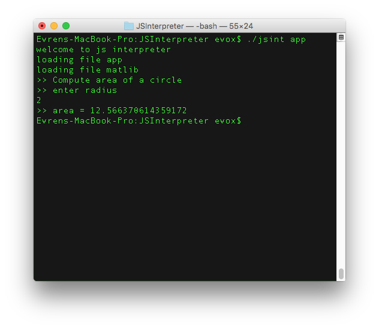

JSInterpreter
=====================



This is an experiment on Swift, JavaScriptCore and out-of-xcode compilation of
Swift and Objective-C projects. 

JSInterpreter is javascript interpreter for command line.

Exposing required native functionality to javascript vm, like node.js does, one can create a node.js clone in Swift in this way, i guess.

For now, we dont have network functionality, but only 3 native calls such as,

require(fileName): imports common.js module

input(): reads from command line

log(String): prints out to command line


##Compile project
First of all, you need to compile project using swift compiler.

```bash
$ swiftc jsinterpreter.swift -o jsint
```

Then simply run the sample app

```bash
$ jsint app
```

##Sample App
jsinterpeter loads and executes the file specified as argument.
structure of a simple app looks like:

```js
var lib = require('matlib');

log("compute area of a circle");
log("enter radius");
var radius = input();

log("area = " + lib.circleArea(radius));
```

Three basic functinality demonstrated here. 

1. first, load a module called 'matlib' which cotains  functions we need. 

2. log something to the command line

3. read from command line and assign the user typed value to a variable

##Download content app

```js
log("welcome to git explorer");

// ask user name
log("enter github username");
var userName = input();

// download github user data
var dataString = download('https://api.github.com/users/'+ userName +'/repos');

var objData = JSON.parse(dataString);

// list repos of user
log(userName + "'s repos (" + objData.length + ")")
objData.forEach(function(repo) {
	log(repo.name);
});
```


##Roadmap
1. improve require function

	▢ improve to load modules from relative paths

	▢ some commonjs modules cannot be loaded (markdown.js), create actual evaluation of module.exports object.

2. expose more native functions

	✓ download contents of url

	▢ $.post

3. improve logging function

	▢ colors, icons etc ...
